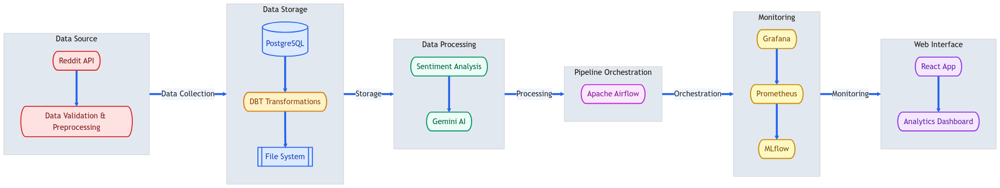

# Reddit Text Insight & Sentiment Analysis Pipeline

A comprehensive data engineering pipeline for collecting, processing, and analyzing Reddit content using modern data stack and LLMs.

## Overview

This project implements an end-to-end data pipeline that:
- Collects data from Reddit API (posts and comments)
- Processes and transforms data using Apache Spark
- Performs text summarization using BART model
- Analyzes sentiment using RoBERTa
- Generates insights using Google's Gemini
- Provides monitoring through Prometheus & Grafana

## Architecture


## Project Structure
```plaintext
Local/
├── airflow_project/ # Main Airflow project directory
│ ├── dags/ # Airflow DAG definitions
│ ├── logs/ # Airflow execution logs
│ └── plugins/ # Airflow plugins
│   └── Logging metrics
│
├── config/ # Configuration files and settings
│
├── database/ # Database scripts and schemas
│
├── preprocessing/ # Data preprocessing modules
│
├── dbt_reddit_summary_local/ # dbt models for data transformation
│ └── models/ # dbt transformation models
│
├── docker/ # Docker configuration files
│ ├── Dockerfile.webserver # Airflow webserver configuration
│ ├── Dockerfile.scheduler # Airflow scheduler configuration
│ ├── Dockerfile.worker # Airflow worker configuration
│ ├── docker-compose.yml # Docker services configuration
│─── prometheus/ # Prometheus configuration
│     └── prometheus.yml # Prometheus scrape config
│
├── grafana/ # Grafana configuration
│ └── provisioning/ # Grafana provisioning
│     ├── dashboards/ # Dashboard definitions
│     │   ├── pipeline_metrics.json
│     │   └── default.yaml
│     └── datasources/ # Data source configurations
│         └── prometheus.yml
│
├── mlflow/ # MLflow tracking and artifacts
│ └── mlruns/ # MLflow experiment tracking
│
├── results/ # Pipeline output results
│
└── scripts/ # Utility scripts
  └── logs/ # Script execution logs
```

## System Architecture: Modular and Scalable Design

Our pipeline is designed with modularity and scalability in mind, comprising six main layers. Below is a high-level overview of how the components interact:


The diagram above illustrates the flow of data through our system, from collection to presentation. Each layer has specific responsibilities and communicates with adjacent layers through well-defined interfaces.

---

### 1. Data Collection Layer
- **Reddit API Integration**:
    - Fetch posts and comments from AI-focused subreddits.
- **Text Preprocessing and Cleaning**:
    - Separate processing pipelines for posts and comments.
    - Remove special characters and formatting.
- **Content Validation and Filtering**: 
    - Ensure only relevant and high-quality data is processed.
- **Rate Limiting and Error Handling**: 
    - Manage API limits.
- **DBT Transformations**:
    - Stage posts and comments for further processing.
    - Clean and standardize data structures.
    - Manage processing state for each pipeline run.
    - Automate cleanup upon pipeline completion.

---

### 2. Storage Layer
- **PostgreSQL Database**: 
    - Structured data storage with the following tables:
        - Raw data tables for posts and comments.
        - DBT staging tables for processing queues.
        - Processed results tables for analysis outputs.
- **Organized File System**:
    - Store analysis outputs in a structured and accessible manner.
- **Data Versioning and Backup**:
    - Implement robust strategies for data integrity and recovery.

---

### 3. Processing Layer
- **Text Summarization**: Generate concise summaries of discussions.
- **Sentiment Analysis**: Extract emotional context from posts and comments.
- **Gemini AI Integration**: Perform comprehensive content analysis using LLMs.

---

### 4. Orchestration Layer
- **Airflow DAGs**: Manage pipeline workflows efficiently.
- **Scheduled Task Execution**: Automate task triggers based on predefined schedules.
- **Monitoring and Error Handling**: Ensure reliability through automated checks.

---

### 5. Observability Layer
- **Grafana Dashboards**: Provide real-time monitoring of pipeline health and performance.
- **Prometheus Metrics Collection**: Gather and analyze system metrics.
- **MLflow**: Track machine learning experiments and maintain a model registry.

---

### 6. Presentation Layer
- **React-Based Web Application**: Present insights through an interactive user interface.
- **Automated Deployment**: Streamline updates using GitHub Actions.
- **Real-Time Data Synchronization**: Provides updates in batches (daily updates) to ensure users receive timely insights.
- **Interactive Visualizations**: Enable dynamic exploration of AI-related discussions.

---

## Getting Started

1. Clone the repository
2. Create a new `.env` file in the root directory
3. Configure credentials in `.env`
4. Install dependencies:
   ```bash
   docker compose --env-file ../.env up -d # always include the env file
   ```
5. Access services:
   - Airflow: http://localhost:8080
   - Prometheus: http://localhost:9090
   - Grafana: http://localhost:3000
   - MLflow: http://localhost:5000

6. Start the pipeline:
   ```bash
   airflow dags unpause reddit_pipeline_dag
   ```

## Tech Stack

- **Orchestration**: Apache Airflow
- **Processing**: Apache Spark
- **Transformation**: dbt
- **ML Models**: BART, RoBERTa, Gemini
- **Monitoring**: Prometheus, Grafana
- **Storage**: PostgreSQL
- **ML Tracking**: MLflow

## License

MIT License


